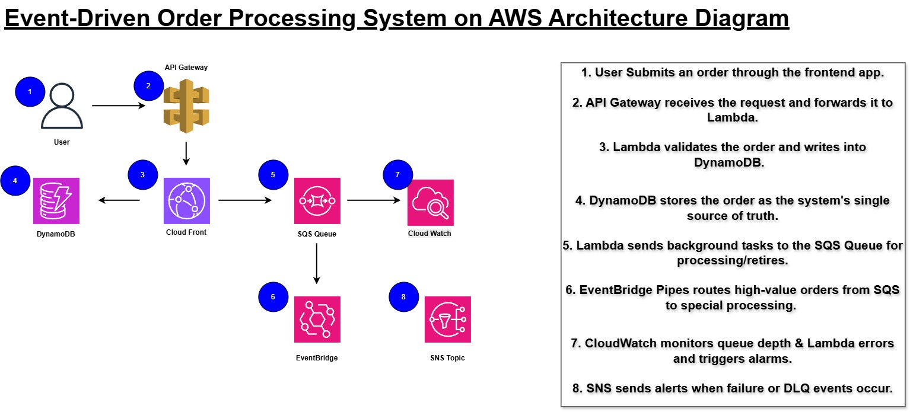
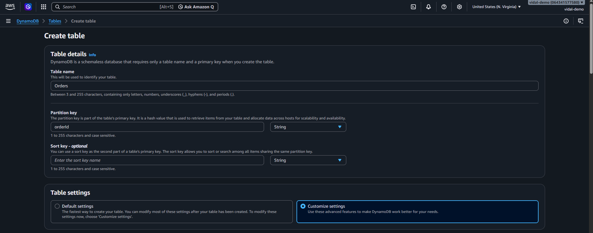
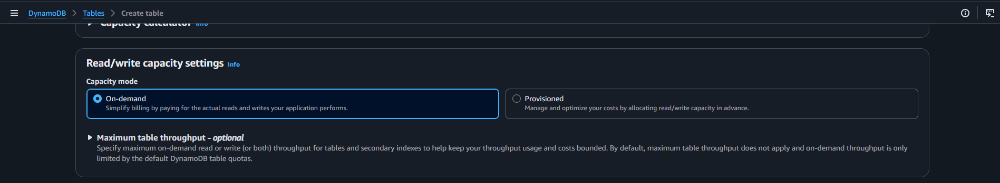

# aws-event-driven-order-processing
Serverless event-driven order processing system on AWS using API Gateway, Lambda, DynamoDB, SQS, EventBridge Pipes, DLQ, CloudWatch, and SNS.

# Event-Driven Order Processing System on AWS

---

## Overview of Project

### Scenario

A growing e-commerce company processes hundreds of customer orders each day. Every order requires several backend actions, including storing the order, validating business rules, processing tasks in the background, retrying failed requests, and notifying the team when problems occur.

The current environment relies on a **single backend server** to manage the entire workflow. As order volume grows, this design introduces several challenges:

- Performance decreases during periods of high traffic
- Failed orders are difficult to identify and troubleshoot
- A single failure can affect the entire request
- Failed processing does not automatically retry
- High-value orders are not handled separately
- The team does not receive automatic alerts when failures occur

The goal of this project is to replace this tightly coupled design with a **serverless, event-driven architecture** where services can operate independently, failures can be isolated, and the system can scale with demand.

---

### My Role as the Cloud Engineer

As the Cloud Engineer, I will design and implement the AWS infrastructure required to modernize the order processing workflow.

The new solution will support:

- Fast customer order submission
- Asynchronous background processing
- Automatic retry handling
- Dead-letter queue processing
- Event-based routing
- Dedicated handling for high-value orders
- Monitoring and failure notifications

This project demonstrates how AWS managed services can be combined to create a scalable and resilient backend for modern e-commerce applications.

---

### Solution

I will build a **serverless, event-driven order processing system using AWS managed services**.

Customer orders will enter the environment through **Amazon API Gateway** and be processed by **AWS Lambda** before being stored in **Amazon DynamoDB**.

**DynamoDB Streams** will detect new order activity and trigger downstream processing. **Amazon SQS** will provide asynchronous message handling, retries, and reliable background processing.

Worker Lambda functions will process orders and update their status, while **Amazon EventBridge Pipes** will identify and route high-value orders through a separate processing path.

Orders that repeatedly fail will be moved to a **Dead-Letter Queue (DLQ)** for investigation. **Amazon CloudWatch** and **Amazon SNS** will provide monitoring and real-time failure notifications.

The final architecture will provide a scalable and reliable order processing system without requiring traditional servers to manage.

---

### About the Project

In this project, I will:

- Build a **frontend order submission application**
- Store orders and track their status in **Amazon DynamoDB**
- Use **Amazon SQS** for asynchronous processing and retries
- Build worker **AWS Lambda** functions to process orders and enforce business rules
- Route high-value orders using **Amazon EventBridge Pipes**
- Configure a **Dead-Letter Queue (DLQ)** for failed messages
- Configure **Amazon CloudWatch Alarms**
- Configure **Amazon SNS** for real-time failure notifications

By the end of this project, I will have a fully operational distributed order processing workflow built with AWS managed services.

---

## Steps To Be Performed 👩‍💻

1. Build the Order Ingestion Layer using **DynamoDB, Lambda, API Gateway, and the frontend**
2. Trigger downstream processing using **DynamoDB Streams**
3. Add **Amazon SQS** for retries and resilient background processing
4. Route high-value orders using **Amazon EventBridge Pipes**
5. Add **Dead-Letter Queue handling**
6. Configure **alerts and observability**

---

## Services Used 🛠

- **Amazon API Gateway** - Provides the order submission endpoint
- **AWS Lambda** - Runs business logic and background workers
- **Amazon DynamoDB** - Stores order information and processing status
- **DynamoDB Streams** - Generates real-time events from database changes
- **Amazon SQS** - Provides queueing, retries, and asynchronous processing
- **Dead-Letter Queue (DLQ)** - Isolates messages that repeatedly fail
- **Amazon EventBridge Pipes** - Filters and routes high-value order events
- **Amazon SNS** - Sends failure notifications
- **Amazon CloudWatch** - Provides metrics, monitoring, and alarms

---

## ➡️ Architectural Diagram

The following diagram shows the architecture for the event-driven order processing system.



---

## ➡️ Final Results

At the end of this project, I will have a fully functional AWS order processing system that includes:

- **Event-driven order processing with real-time validation**
- **Automatic retry handling**
- **Separate routing for high-value orders**
- **DLQ-based fault isolation**
- **CloudWatch monitoring and SNS alerting**

---

# 4.2 Build the Order Ingestion Layer & Frontend Web App

---

## Overview

In this section, I built the first stage of the order processing system: the **order ingestion layer**.

The goal was to allow a customer to submit an order through a frontend web application and store that order in Amazon DynamoDB.

This stage includes:

- An **Amazon DynamoDB table** to store orders
- An **AWS Lambda function** to create orders
- An **Amazon API Gateway HTTP API** to expose the Lambda function
- A simple **frontend web application** for submitting orders

By the end of this section, I was able to submit an order through the web application and confirm that the order was successfully stored in DynamoDB.

For this stage, the focus is only on the **create-order workflow**. Services such as SQS, DLQs, and EventBridge Pipes will be added later.

---

## Step 1: Create the DynamoDB Table

I created a DynamoDB table to store incoming customer orders.

### Configuration

- **Table name:** `Orders`
- **Partition key:** `orderId`
- **Partition key type:** `String`
- **Sort key:** None



For the table capacity settings, I selected:

- **Capacity mode:** On-demand



I left the remaining advanced settings at their default values and created the table.

---

## Step 2: Enable DynamoDB Streams

After creating the `Orders` table, I enabled **DynamoDB Streams**.

This will allow changes made to the table to trigger downstream processing later in the project.

### Configuration

- Open the `Orders` table
- Navigate to **Exports and streams**
- Locate **DynamoDB stream details**
- Enable DynamoDB Streams


I configured the stream type as:

```text
NEW_AND_OLD_IMAGES
```


---

## Step 3: Create an IAM Role for Lambda

Next, I created an IAM role that allows the Lambda function to interact with the AWS services required for the project.

### IAM Configuration

- **Trusted entity type:** AWS Service
- **Use case:** Lambda


I attached the following managed policies:

- `AmazonDynamoDBFullAccess`
- `CloudWatchLogsFullAccess`
- `AmazonSQSFullAccess`

For this lab, full-access policies are being used for simplicity. In a production environment, permissions should be restricted using the **principle of least privilege**.

### Role Name

```text
OrderServiceLambdaRole
```


---

## Step 4: Create the CreateOrder Lambda Function

I created an AWS Lambda function responsible for receiving order information, validating the request, generating a unique order ID, and storing the order in DynamoDB.

### Lambda Configuration

- **Function name:** `CreateOrderFunction`
- **Runtime:** `Node.js 24.x` or the latest available Node.js runtime


For the execution role, I selected:

```text
Use an existing role
```

and assigned:

```text
OrderServiceLambdaRole
```


### Environment Variable

I added the following environment variable:

```text
Key: ORDERS_TABLE_NAME
Value: Orders
```


The Lambda function performs the following tasks:

- Reads the incoming request
- Validates required order fields
- Generates a unique `orderId`
- Generates a creation timestamp
- Stores the order in DynamoDB
- Sets the initial status to `PENDING`
- Returns the generated order ID

### Lambda Code

```javascript
import { DynamoDBClient, PutItemCommand } from "@aws-sdk/client-dynamodb";
import crypto from "crypto";

const ddbClient = new DynamoDBClient();

export const handler = async (event) => {
  console.log("Received event:", JSON.stringify(event));

  try {
    const body =
      typeof event.body === "string"
        ? JSON.parse(event.body)
        : event.body || {};

    const { customerName, amount, product, notes } = body;

    if (!customerName || !amount || !product) {
      return {
        statusCode: 400,
        headers: {
          "Content-Type": "application/json",
          "Access-Control-Allow-Origin": "*",
          "Access-Control-Allow-Headers": "*",
          "Access-Control-Allow-Methods": "*"
        },
        body: JSON.stringify({
          message: "customerName, amount, and product are required.",
        }),
      };
    }

    const orderId = crypto.randomUUID();
    const createdAt = new Date().toISOString();

    await ddbClient.send(
      new PutItemCommand({
        TableName: process.env.ORDERS_TABLE_NAME,
        Item: {
          orderId: { S: orderId },
          customerName: { S: customerName },
          amount: { N: String(amount) },
          product: { S: product },
          notes: { S: notes || "" },
          status: { S: "PENDING" },
          createdAt: { S: createdAt },
        },
      })
    );

    return {
      statusCode: 201,
      headers: {
        "Content-Type": "application/json",
        "Access-Control-Allow-Origin": "*",
        "Access-Control-Allow-Headers": "*",
        "Access-Control-Allow-Methods": "*"
      },
      body: JSON.stringify({
        message: "Order created successfully",
        orderId,
        status: "PENDING"
      }),
    };
  } catch (error) {
    console.error("Error creating order:", error);

    return {
      statusCode: 500,
      headers: {
        "Content-Type": "application/json",
        "Access-Control-Allow-Origin": "*",
        "Access-Control-Allow-Headers": "*",
        "Access-Control-Allow-Methods": "*"
      },
      body: JSON.stringify({ message: "Internal server error" }),
    };
  }
};
```

After adding the code, I deployed the function.


> **Note:** The function uses AWS SDK v3, which is included with newer Lambda Node.js runtimes.

---

## Step 5: Test the Lambda Function

Before connecting Lambda to API Gateway, I tested the function directly.

### Test Event

```json
{
  "body": "{\"customerName\":\"Alice\",\"amount\":1499,\"product\":\"Wireless Headphones\",\"notes\":\"Express delivery\"}"
}
```


A successful test should return:

- **Status code:** `201`
- A JSON response containing the generated `orderId`


I then opened:

```text
DynamoDB → Orders → Explore table items
```

and confirmed that the order was stored successfully.


I also verified the individual order record and its stored attributes.


Once the order appeared in DynamoDB, the core order creation logic was working correctly.

---

## Step 6: Create the API Gateway HTTP API

Next, I created an Amazon API Gateway **HTTP API** to expose the Lambda function through an HTTP endpoint.

### API Configuration

- **API type:** HTTP API
- **API name:** `order-api`
- **Integration:** Lambda
- **Lambda function:** `CreateOrderFunction`

### Route Configuration

- **Method:** `POST`
- **Resource path:** `/order`
- **Integration:** `CreateOrderFunction`


I connected the route to the Lambda integration.


### Stage Configuration

- **Stage name:** `prod`
- **Auto deploy:** Disabled


After creating the API, I copied the **Invoke URL**.


The order endpoint follows this structure:

```text
https://<api-id>.execute-api.<region>.amazonaws.com/prod/order
```

This URL will be used by the frontend application.

---

## Step 7: Enable CORS

Because the frontend application sends requests to API Gateway from a browser, I enabled **Cross-Origin Resource Sharing (CORS)**.

### CORS Configuration

- **Allowed origins:** `*`
- **Allowed methods:** `*`
- **Allowed headers:** `*`


After saving the configuration, I deployed the API to the `prod` stage.


---

## Step 8: Build the Frontend Order Submission App

Next, I created a simple frontend application for submitting customer orders.

The frontend uses an `index.html` file containing:

- HTML for the order form
- CSS for styling
- JavaScript for communicating with API Gateway

The form collects:

- Customer Name
- Product
- Amount
- Optional Notes


Inside the frontend JavaScript, I replaced the placeholder API URL:

```javascript
const API_URL = "https://YOUR_API_ID.execute-api.YOUR_REGION.amazonaws.com/prod/order";
```

with the actual API Gateway endpoint.


### Run the Frontend Locally

Instead of opening the file directly with `file://`, I served it through a local HTTP server.

From the folder containing `index.html`, I ran:

```bash
python3 -m http.server 5500
```


I then opened the application in the browser using:

```text
http://localhost:5500/index.html
```


---

## Step 9: Test the Full Flow

With the frontend, API Gateway, Lambda, and DynamoDB connected, I tested the complete order submission workflow.

I entered:

- Customer Name
- Product
- Amount
- Notes


After clicking **Submit Order**, the application returned a success message containing the generated order ID.

```text
Order created successfully! Order ID: ...
```


Finally, I returned to:

```text
DynamoDB → Orders → Explore table items
```

and confirmed that the new order contained:

- `orderId`
- `amount`
- `createdAt`
- `customerName`
- `notes`
- `product`
- `status = PENDING`


---

## Completion

The **Order Ingestion Layer and Frontend Web App** are now complete.

At this stage, the system can:

- Accept order information through the frontend
- Send the request through API Gateway
- Process the request using Lambda
- Generate a unique order ID
- Store the order in DynamoDB
- Assign the initial order status as `PENDING`

The next stage will use **DynamoDB Streams** to begin the event-driven processing workflow.

---
