# aws-event-driven-order-processing
Serverless event-driven order processing system on AWS using API Gateway, Lambda, DynamoDB, SQS, EventBridge Pipes, DLQ, CloudWatch, and SNS.

# Event-Driven Order Processing System on AWS

---

## Overview of Project

### Scenario

A growing e-commerce company processes hundreds of customer orders each day. Every order requires several backend actions, including storing the order, validating business rules, processing tasks in the background, retrying failed requests, and notifying the team when problems occur.

The current environment relies on a **single backend server** to manage the entire workflow. As order volume grows, this design introduces several challenges:

- Performance decreases during periods of high traffic
- Failed orders are difficult to identify and troubleshoot
- A single failure can affect the entire request
- Failed processing does not automatically retry
- High-value orders are not handled separately
- The team does not receive automatic alerts when failures occur

The goal of this project is to replace this tightly coupled design with a **serverless, event-driven architecture** where services can operate independently, failures can be isolated, and the system can scale with demand.

---

### My Role as the Cloud Engineer

As the Cloud Engineer, I will design and implement the AWS infrastructure required to modernize the order processing workflow.

The new solution will support:

- Fast customer order submission
- Asynchronous background processing
- Automatic retry handling
- Dead-letter queue processing
- Event-based routing
- Dedicated handling for high-value orders
- Monitoring and failure notifications

This project demonstrates how AWS managed services can be combined to create a scalable and resilient backend for modern e-commerce applications.

---

### Solution

I will build a **serverless, event-driven order processing system using AWS managed services**.

Customer orders will enter the environment through **Amazon API Gateway** and be processed by **AWS Lambda** before being stored in **Amazon DynamoDB**.

**DynamoDB Streams** will detect new order activity and trigger downstream processing. **Amazon SQS** will provide asynchronous message handling, retries, and reliable background processing.

Worker Lambda functions will process orders and update their status, while **Amazon EventBridge Pipes** will identify and route high-value orders through a separate processing path.

Orders that repeatedly fail will be moved to a **Dead-Letter Queue (DLQ)** for investigation. **Amazon CloudWatch** and **Amazon SNS** will provide monitoring and real-time failure notifications.

The final architecture will provide a scalable and reliable order processing system without requiring traditional servers to manage.

---

### About the Project

In this project, I will:

- Build a **frontend order submission application**
- Store orders and track their status in **Amazon DynamoDB**
- Use **Amazon SQS** for asynchronous processing and retries
- Build worker **AWS Lambda** functions to process orders and enforce business rules
- Route high-value orders using **Amazon EventBridge Pipes**
- Configure a **Dead-Letter Queue (DLQ)** for failed messages
- Configure **Amazon CloudWatch Alarms**
- Configure **Amazon SNS** for real-time failure notifications

By the end of this project, I will have a fully operational distributed order processing workflow built with AWS managed services.

---

## Steps To Be Performed 👩‍💻

1. Build the Order Ingestion Layer using **DynamoDB, Lambda, API Gateway, and the frontend**
2. Trigger downstream processing using **DynamoDB Streams**
3. Add **Amazon SQS** for retries and resilient background processing
4. Route high-value orders using **Amazon EventBridge Pipes**
5. Add **Dead-Letter Queue handling**
6. Configure **alerts and observability**

---

## Services Used 🛠

- **Amazon API Gateway** - Provides the order submission endpoint
- **AWS Lambda** - Runs business logic and background workers
- **Amazon DynamoDB** - Stores order information and processing status
- **DynamoDB Streams** - Generates real-time events from database changes
- **Amazon SQS** - Provides queueing, retries, and asynchronous processing
- **Dead-Letter Queue (DLQ)** - Isolates messages that repeatedly fail
- **Amazon EventBridge Pipes** - Filters and routes high-value order events
- **Amazon SNS** - Sends failure notifications
- **Amazon CloudWatch** - Provides metrics, monitoring, and alarms

---

## ➡️ Architectural Diagram

The following diagram shows the architecture for the event-driven order processing system.


---

## ➡️ Final Results

At the end of this project, I will have a fully functional AWS order processing system that includes:

- **Event-driven order processing with real-time validation**
- **Automatic retry handling**
- **Separate routing for high-value orders**
- **DLQ-based fault isolation**
- **CloudWatch monitoring and SNS alerting**

---

# 4.2 Build the Order Ingestion Layer & Frontend Web App

---

## Overview

In this section, I built the first stage of the order processing system: the **order ingestion layer**.

The goal was to allow a customer to submit an order through a frontend web application and store that order in Amazon DynamoDB.

This stage includes:

- An **Amazon DynamoDB table** to store orders
- An **AWS Lambda function** to create orders
- An **Amazon API Gateway HTTP API** to expose the Lambda function
- A simple **frontend web application** for submitting orders

By the end of this section, I was able to submit an order through the web application and confirm that the order was successfully stored in DynamoDB.

For this stage, the focus is only on the **create-order workflow**. Services such as SQS, DLQs, and EventBridge Pipes will be added later.

---

## Step 1: Create the DynamoDB Table

I created a DynamoDB table to store incoming customer orders.

### Configuration

- **Table name:** `Orders`
- **Partition key:** `orderId`
- **Partition key type:** `String`
- **Sort key:** None


For the table capacity settings, I selected:

- **Capacity mode:** On-demand


I left the remaining advanced settings at their default values and created the table.

---

## Step 2: Enable DynamoDB Streams

After creating the `Orders` table, I enabled **DynamoDB Streams**.

This will allow changes made to the table to trigger downstream processing later in the project.

### Configuration

- Open the `Orders` table
- Navigate to **Exports and streams**
- Locate **DynamoDB stream details**
- Enable DynamoDB Streams

I configured the stream type as:

```text
NEW_AND_OLD_IMAGES
```

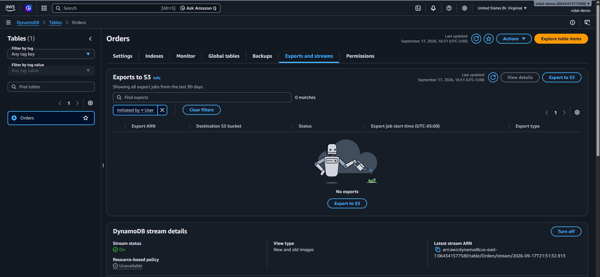

---

## Step 3: Create an IAM Role for Lambda

Next, I created an IAM role that allows the Lambda function to interact with the AWS services required for the project.

### IAM Configuration

- **Trusted entity type:** AWS Service
- **Use case:** Lambda

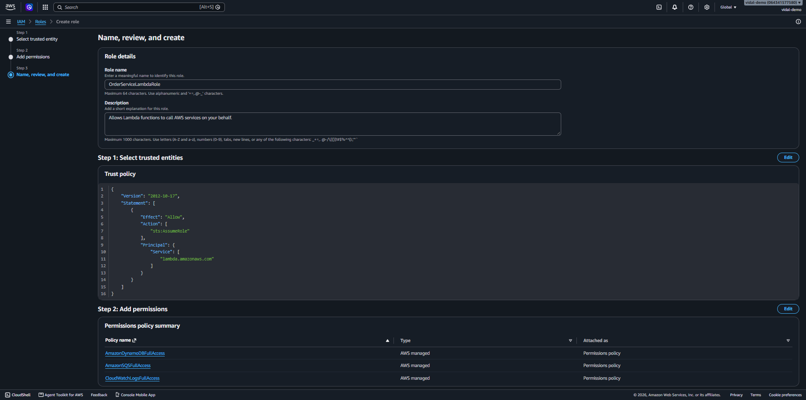

I attached the following managed policies:

- `AmazonDynamoDBFullAccess`
- `CloudWatchLogsFullAccess`
- `AmazonSQSFullAccess`

For this lab, full-access policies are being used for simplicity. In a production environment, permissions should be restricted using the **principle of least privilege**.

### Role Name

```text
OrderServiceLambdaRole
```

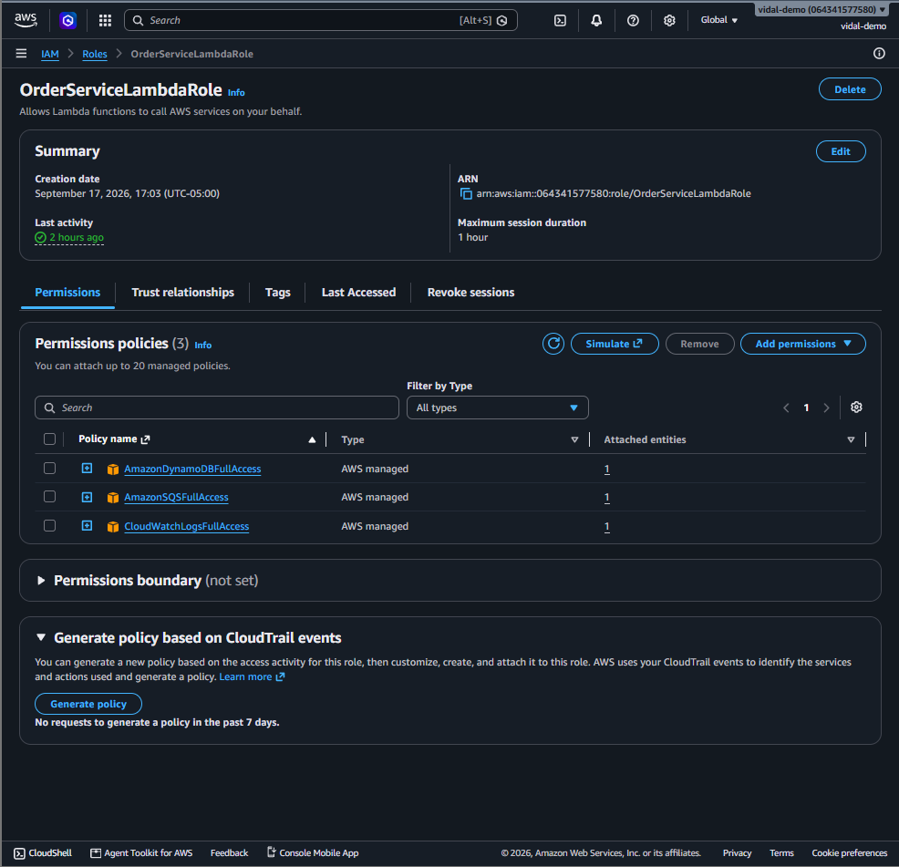

---

## Step 4: Create the CreateOrder Lambda Function

I created an AWS Lambda function responsible for receiving order information, validating the request, generating a unique order ID, and storing the order in DynamoDB.

### Lambda Configuration

- **Function name:** `CreateOrderFunction`
- **Runtime:** `Node.js 24.x` or the latest available Node.js runtime

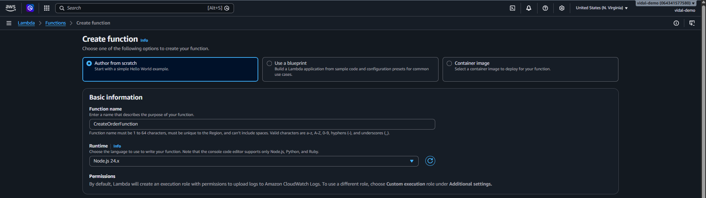

For the execution role, I selected:

```text
Use an existing role
```

and assigned:

```text
OrderServiceLambdaRole
```

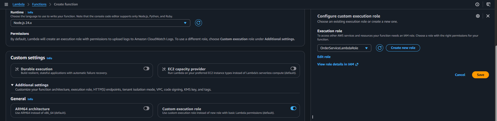

### Environment Variable

I added the following environment variable:

```text
Key: ORDERS_TABLE_NAME
Value: Orders
```

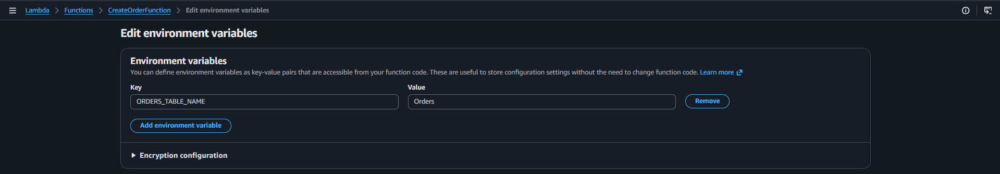

The Lambda function performs the following tasks:

- Reads the incoming request
- Validates required order fields
- Generates a unique `orderId`
- Generates a creation timestamp
- Stores the order in DynamoDB
- Sets the initial status to `PENDING`
- Returns the generated order ID

### Lambda Code

```javascript
import { DynamoDBClient, PutItemCommand } from "@aws-sdk/client-dynamodb";
import crypto from "crypto";

const ddbClient = new DynamoDBClient();

export const handler = async (event) => {
  console.log("Received event:", JSON.stringify(event));

  try {
    const body =
      typeof event.body === "string"
        ? JSON.parse(event.body)
        : event.body || {};

    const { customerName, amount, product, notes } = body;

    if (!customerName || !amount || !product) {
      return {
        statusCode: 400,
        headers: {
          "Content-Type": "application/json",
          "Access-Control-Allow-Origin": "*",
          "Access-Control-Allow-Headers": "*",
          "Access-Control-Allow-Methods": "*"
        },
        body: JSON.stringify({
          message: "customerName, amount, and product are required.",
        }),
      };
    }

    const orderId = crypto.randomUUID();
    const createdAt = new Date().toISOString();

    await ddbClient.send(
      new PutItemCommand({
        TableName: process.env.ORDERS_TABLE_NAME,
        Item: {
          orderId: { S: orderId },
          customerName: { S: customerName },
          amount: { N: String(amount) },
          product: { S: product },
          notes: { S: notes || "" },
          status: { S: "PENDING" },
          createdAt: { S: createdAt },
        },
      })
    );

    return {
      statusCode: 201,
      headers: {
        "Content-Type": "application/json",
        "Access-Control-Allow-Origin": "*",
        "Access-Control-Allow-Headers": "*",
        "Access-Control-Allow-Methods": "*"
      },
      body: JSON.stringify({
        message: "Order created successfully",
        orderId,
        status: "PENDING"
      }),
    };
  } catch (error) {
    console.error("Error creating order:", error);

    return {
      statusCode: 500,
      headers: {
        "Content-Type": "application/json",
        "Access-Control-Allow-Origin": "*",
        "Access-Control-Allow-Headers": "*",
        "Access-Control-Allow-Methods": "*"
      },
      body: JSON.stringify({ message: "Internal server error" }),
    };
  }
};
```

After adding the code, I deployed the function.

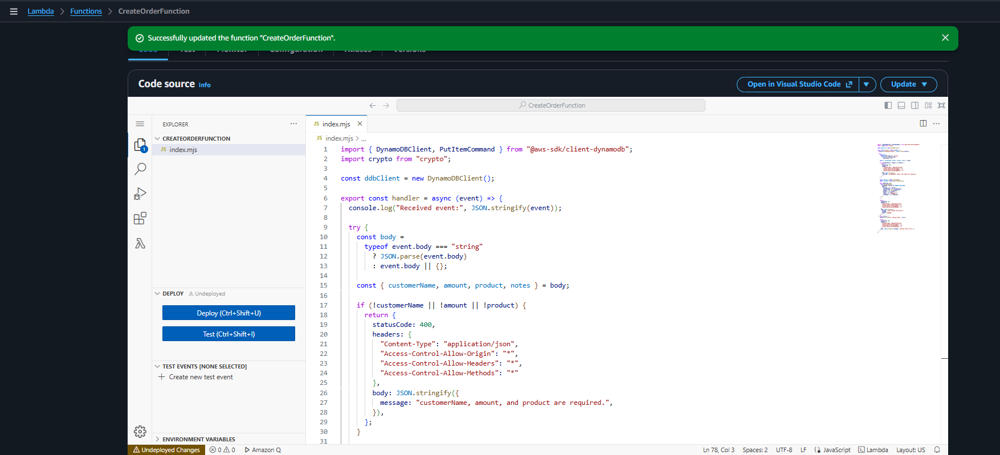

> **Note:** The function uses AWS SDK v3, which is included with newer Lambda Node.js runtimes.

---

## Step 5: Test the Lambda Function

Before connecting Lambda to API Gateway, I tested the function directly.

### Test Event

```json
{
  "body": "{\"customerName\":\"Alice\",\"amount\":1499,\"product\":\"Wireless Headphones\",\"notes\":\"Express delivery\"}"
}
```

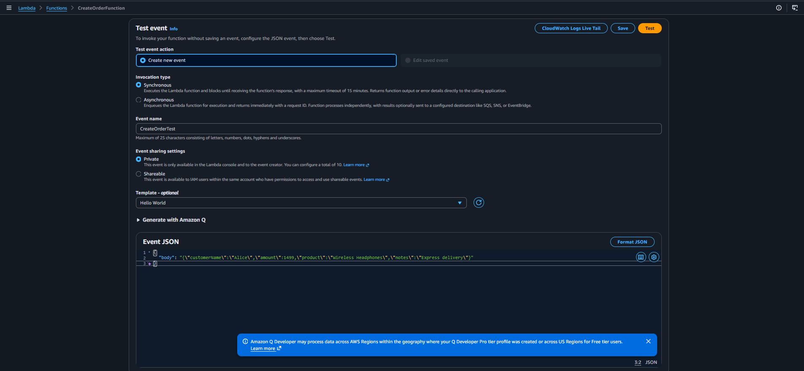

A successful test should return:

- **Status code:** `201`
- A JSON response containing the generated `orderId`

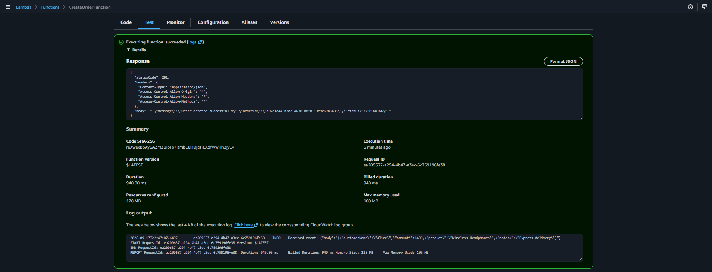

I then opened:

```text
DynamoDB → Orders → Explore table items
```

and confirmed that the order was stored successfully.

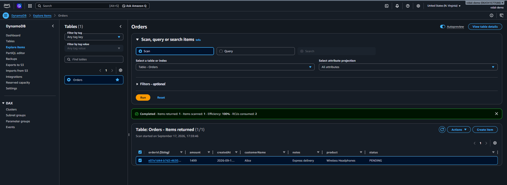

I also verified the individual order record and its stored attributes.

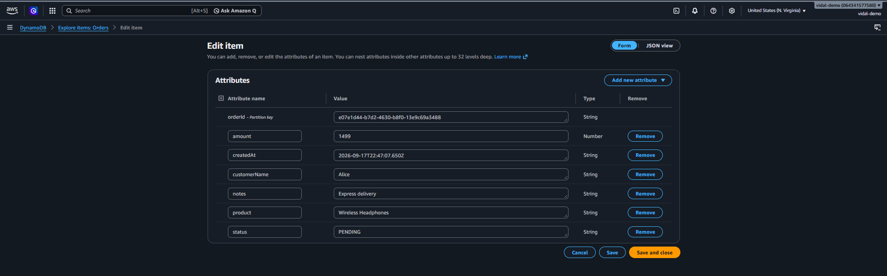

Once the order appeared in DynamoDB, the core order creation logic was working correctly.

---

## Step 6: Create the API Gateway HTTP API

Next, I created an Amazon API Gateway **HTTP API** to expose the Lambda function through an HTTP endpoint.

### API Configuration

- **API type:** HTTP API
- **API name:** `order-api`
- **Integration:** Lambda
- **Lambda function:** `CreateOrderFunction`

### Route Configuration

- **Method:** `POST`
- **Resource path:** `/order`
- **Integration:** `CreateOrderFunction`

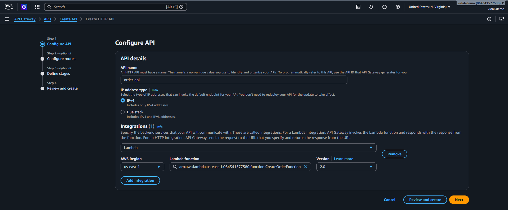

I connected the route to the Lambda integration.

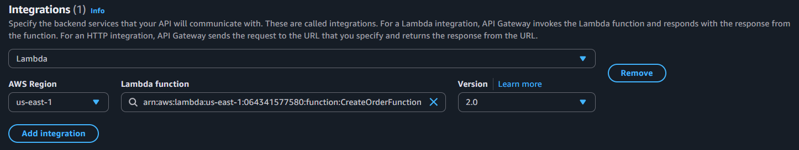

### Stage Configuration

- **Stage name:** `prod`
- **Auto deploy:** Disabled

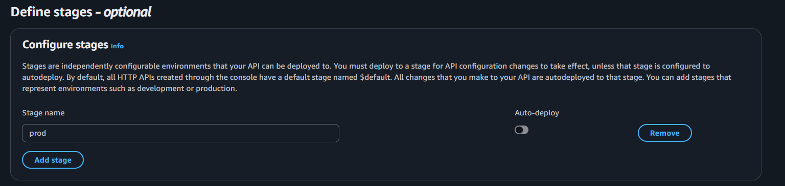

After creating the API, I copied the **Invoke URL**.

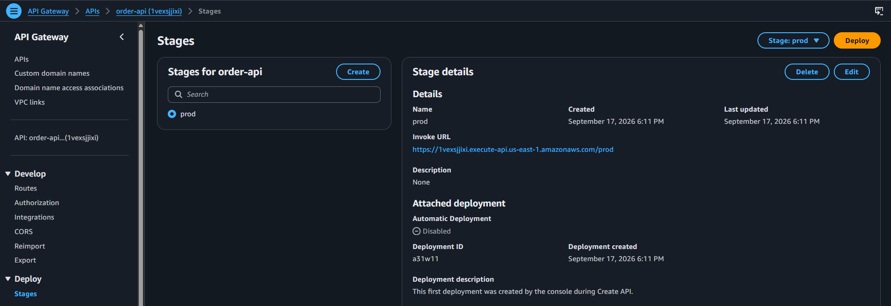

The order endpoint follows this structure:

```text
https://<api-id>.execute-api.<region>.amazonaws.com/prod/order
```

This URL will be used by the frontend application.

---

## Step 7: Enable CORS

Because the frontend application sends requests to API Gateway from a browser, I enabled **Cross-Origin Resource Sharing (CORS)**.

### CORS Configuration

- **Allowed origins:** `*`
- **Allowed methods:** `*`
- **Allowed headers:** `*`

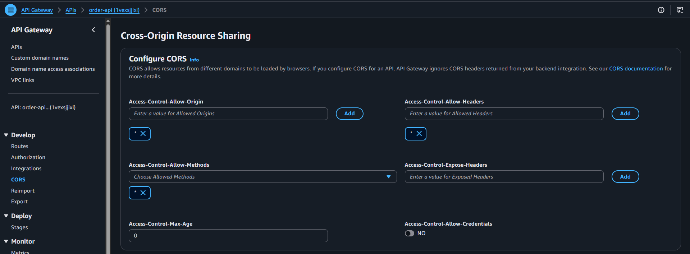

After saving the configuration, I deployed the API to the `prod` stage.

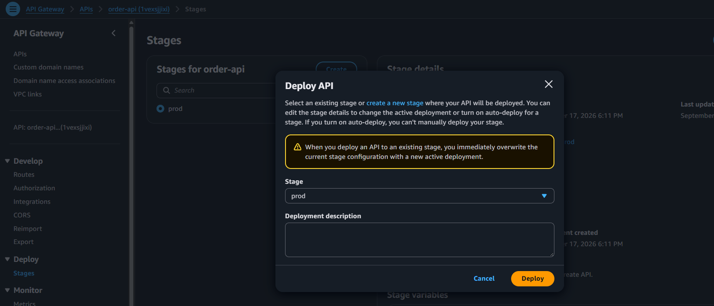

---

## Step 8: Build the Frontend Order Submission App

Next, I created a simple frontend application for submitting customer orders.

The frontend uses an `index.html` file containing:

- HTML for the order form
- CSS for styling
- JavaScript for communicating with API Gateway

The form collects:

- Customer Name
- Product
- Amount
- Optional Notes


Inside the frontend JavaScript, I replaced the placeholder API URL:

```javascript
const API_URL = "https://1vexsjjixi.execute-api.us-east-1.amazonaws.com/prod/order";
```

with the actual API Gateway endpoint.

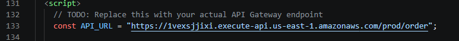

### Run the Frontend Locally

Instead of opening the file directly with `file://`, I served it through a local HTTP server.

From the folder containing `index.html`, I ran:

```bash
python3 -m http.server 5500
```

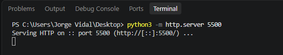

I then opened the application in the browser using:

```text
http://localhost:5500/index.html
```

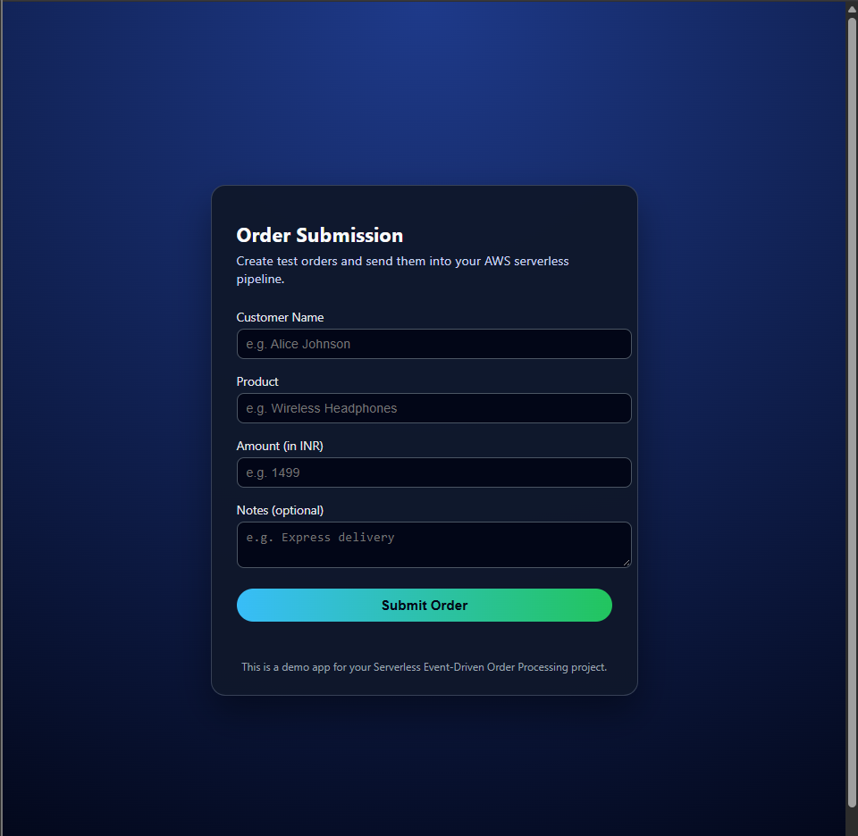

---

## Step 9: Test the Full Flow

With the frontend, API Gateway, Lambda, and DynamoDB connected, I tested the complete order submission workflow.

I entered:

- Customer Name
- Product
- Amount
- Notes

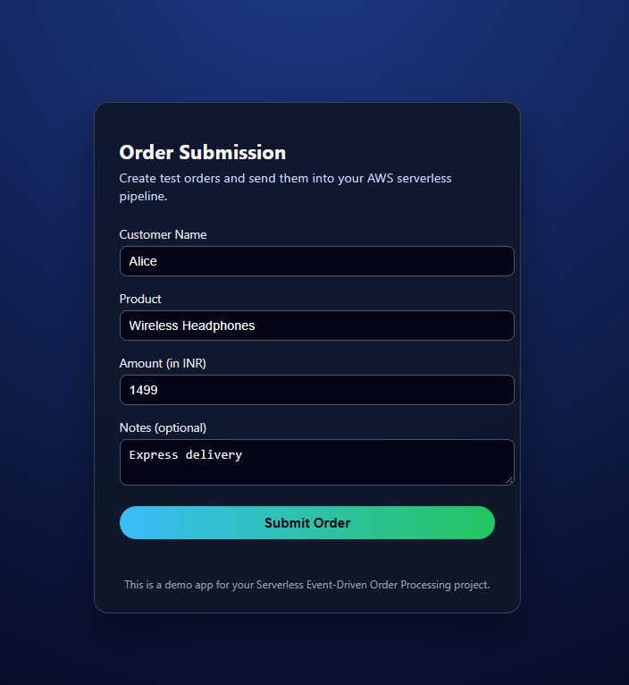

After clicking **Submit Order**, the application returned a success message containing the generated order ID.

```text
Order created successfully! Order ID: ...
```

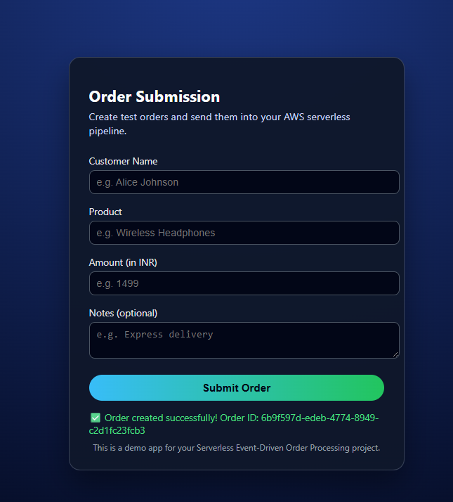

Finally, I returned to:

```text
DynamoDB → Orders → Explore table items
```

and confirmed that the new order contained:

- `orderId`
- `amount`
- `createdAt`
- `customerName`
- `notes`
- `product`
- `status = PENDING`

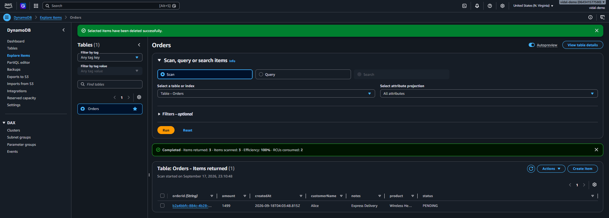

---

## Completion

The **Order Ingestion Layer and Frontend Web App** are now complete.

At this stage, the system can:

- Accept order information through the frontend
- Send the request through API Gateway
- Process the request using Lambda
- Generate a unique order ID
- Store the order in DynamoDB
- Assign the initial order status as `PENDING`

The next stage will use **DynamoDB Streams** to begin the event-driven processing workflow.

---

# 4.3 Real-Time Order Processing with DynamoDB Streams

---

## Overview

In the previous section, I built the **Order Ingestion Layer**, which included:

- An `Orders` DynamoDB table
- A `CreateOrderFunction` Lambda function
- An API Gateway HTTP endpoint
- A frontend web application for submitting orders

At this stage, newly submitted orders are written to DynamoDB with:

```text
status = "PENDING"
```

In this section, I will connect **DynamoDB Streams** to a new Lambda function so that newly created orders can be processed automatically in the background.

The new processing workflow will:

- Listen for `INSERT` events on the `Orders` table
- Read newly created order data
- Log the stream event
- Update the order status to `PROCESSED`
- Add a `processedAt` timestamp

This introduces the first fully **event-driven** component of the project.

---

## Quick View

After completing this section, the workflow will operate as follows:

1. A user submits an order through the web application.
2. The frontend sends the request to API Gateway.
3. `CreateOrderFunction` writes the order to DynamoDB with `status = "PENDING"`.
4. DynamoDB Streams generates an event when the order is inserted.
5. The stream invokes `ProcessOrderFunction`.
6. `ProcessOrderFunction` updates the order with:

```text
status = "PROCESSED"
processedAt = <timestamp>
```

Everything after the order is written to DynamoDB happens automatically in the background.

---

## Step 1: Confirm DynamoDB Streams Are Enabled

Before creating the processing Lambda function, I confirmed that DynamoDB Streams were enabled on the `Orders` table.

I opened:

```text
DynamoDB → Orders → Exports and streams
```

and verified:

- **Stream status:** `On`
- **Stream type:** `New and old images`

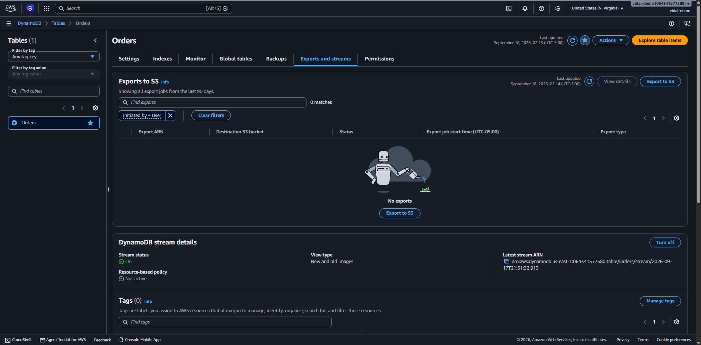

Using `NEW_AND_OLD_IMAGES` makes both the previous and updated versions of an item available in stream records.

For this section, only the new image will be used.

---

## Step 2: Create the ProcessOrderFunction Lambda

Next, I created a new Lambda function that will process orders generated by the DynamoDB Stream.

### Lambda Configuration

- **Function name:** `ProcessOrderFunction`
- **Runtime:** `Node.js 24.x` or the latest supported Node.js runtime
- **Execution role:** Use an existing role
- **IAM role:** `OrderServiceLambdaRole`

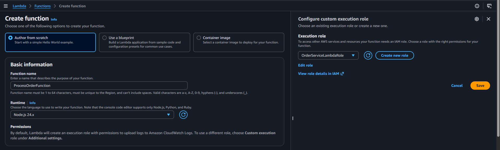

Unlike `CreateOrderFunction`, this Lambda is not called through API Gateway.

It will be triggered automatically by DynamoDB Streams.

---

## Step 3: Add the Environment Variable

Inside `ProcessOrderFunction`, I added the same table environment variable used previously.

### Environment Variable

```text
Key: ORDERS_TABLE_NAME
Value: Orders
```

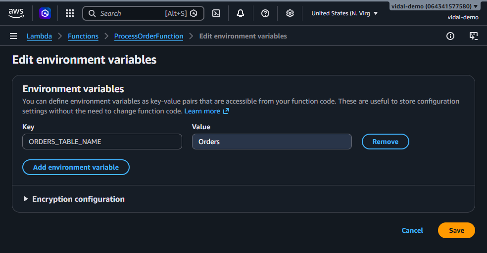

This allows the Lambda function to reference the DynamoDB table without hardcoding the table name directly into the application logic.

---

## Step 4: Understand the DynamoDB Streams Event Format

When DynamoDB Streams invokes Lambda, the function receives an event containing one or more records.

A simplified stream event looks like this:

```json
{
  "Records": [
    {
      "eventName": "INSERT",
      "dynamodb": {
        "NewImage": {
          "orderId": { "S": "1234-5678" },
          "customerName": { "S": "Alice" },
          "amount": { "N": "1499" },
          "product": { "S": "Wireless Headphones" },
          "status": { "S": "PENDING" },
          "createdAt": { "S": "2025-12-01T10:30:00Z" }
        }
      }
    }
  ]
}
```

For this project, the important fields are:

- `Records` — contains the stream records sent to Lambda
- `eventName` — identifies whether the event is an `INSERT`, `MODIFY`, or `REMOVE`
- `dynamodb.NewImage` — contains the new version of the DynamoDB item

The Lambda function will only process records where:

```text
eventName = INSERT
```

---

## Step 5: Add Code to ProcessOrderFunction

The processing Lambda will:

- Loop through incoming stream records
- Ignore events that are not new inserts
- Read the newly created order
- Generate a processing timestamp
- Update the DynamoDB item
- Change the order status to `PROCESSED`
- Add the `processedAt` timestamp

### Lambda Code

```javascript
const { DynamoDBClient, UpdateItemCommand } = require("@aws-sdk/client-dynamodb");

const ddbClient = new DynamoDBClient();

exports.handler = async (event) => {
  console.log("Received DynamoDB Stream event:", JSON.stringify(event, null, 2));

  const tableName = process.env.ORDERS_TABLE_NAME;
  const records = event.Records || [];

  for (const record of records) {
    const eventName = record.eventName;

    if (eventName !== "INSERT") {
      console.log(`Skipping event ${eventName}`);
      continue;
    }

    const newImage = record.dynamodb.NewImage;

    if (!newImage) {
      console.log("No NewImage found, skipping");
      continue;
    }

    const orderId = newImage.orderId.S;
    const customerName = newImage.customerName.S;
    const amount = newImage.amount.N;
    const product = newImage.product.S;

    console.log(
      `Processing new order: ${orderId} for ${customerName}, product: ${product}, amount: ${amount}`
    );

    const processedAt = new Date().toISOString();

    const updateParams = new UpdateItemCommand({
      TableName: tableName,
      Key: {
        orderId: { S: orderId },
      },
      UpdateExpression: "SET #s = :status, processedAt = :processedAt",
      ExpressionAttributeNames: {
        "#s": "status",
      },
      ExpressionAttributeValues: {
        ":status": { S: "PROCESSED" },
        ":processedAt": { S: processedAt },
      },
    });

    try {
      await ddbClient.send(updateParams);
      console.log(`Order ${orderId} marked as PROCESSED at ${processedAt}`);
    } catch (error) {
      console.error(`Failed to update order ${orderId}:`, error);
    }
  }

  return {
    statusCode: 200,
    body: JSON.stringify({ message: "Stream processed" }),
  };
};
```

After adding the code, I deployed `ProcessOrderFunction`.

---

## Understanding the Code

### Initialization

```javascript
const { DynamoDBClient, UpdateItemCommand } = require("@aws-sdk/client-dynamodb");

const ddbClient = new DynamoDBClient();
```

The DynamoDB client and `UpdateItemCommand` are imported and a client instance is created for reuse by the Lambda function.

---

### Handler and Event Logging

```javascript
exports.handler = async (event) => {
  console.log("Received DynamoDB Stream event:", JSON.stringify(event, null, 2));

  const tableName = process.env.ORDERS_TABLE_NAME;
  const records = event.Records || [];
};
```

The Lambda handler receives the stream event, logs it for troubleshooting, reads the DynamoDB table name from the environment variable, and accesses the stream records.

---

### Filtering Stream Records

```javascript
for (const record of records) {
  const eventName = record.eventName;

  if (eventName !== "INSERT") {
    continue;
  }
}
```

DynamoDB Streams can contain different event types.

For this workflow, only newly created orders are processed.

---

### Reading Order Data

```javascript
const newImage = record.dynamodb.NewImage;

const orderId = newImage.orderId.S;
const customerName = newImage.customerName.S;
const amount = newImage.amount.N;
const product = newImage.product.S;
```

The order attributes are extracted from the `NewImage` section of the stream event.

DynamoDB represents values using data types such as:

```text
S = String
N = Number
```

---

### Updating the Order

```javascript
const processedAt = new Date().toISOString();
```

A timestamp is generated when the order is processed.

The Lambda then updates the order with:

```text
status = PROCESSED
processedAt = current timestamp
```

---

## Step 6: Connect DynamoDB Streams to ProcessOrderFunction

Next, I connected the `Orders` DynamoDB Stream to `ProcessOrderFunction`.

I opened:

```text
Lambda → ProcessOrderFunction → Configuration → Triggers
```

and selected **Add trigger**.

### Trigger Configuration

- **Trigger:** DynamoDB
- **DynamoDB table:** `Orders`
- **Batch size:** `1` or `5`
- **EventCount metric:** Enabled
- **Starting position:** `LATEST`

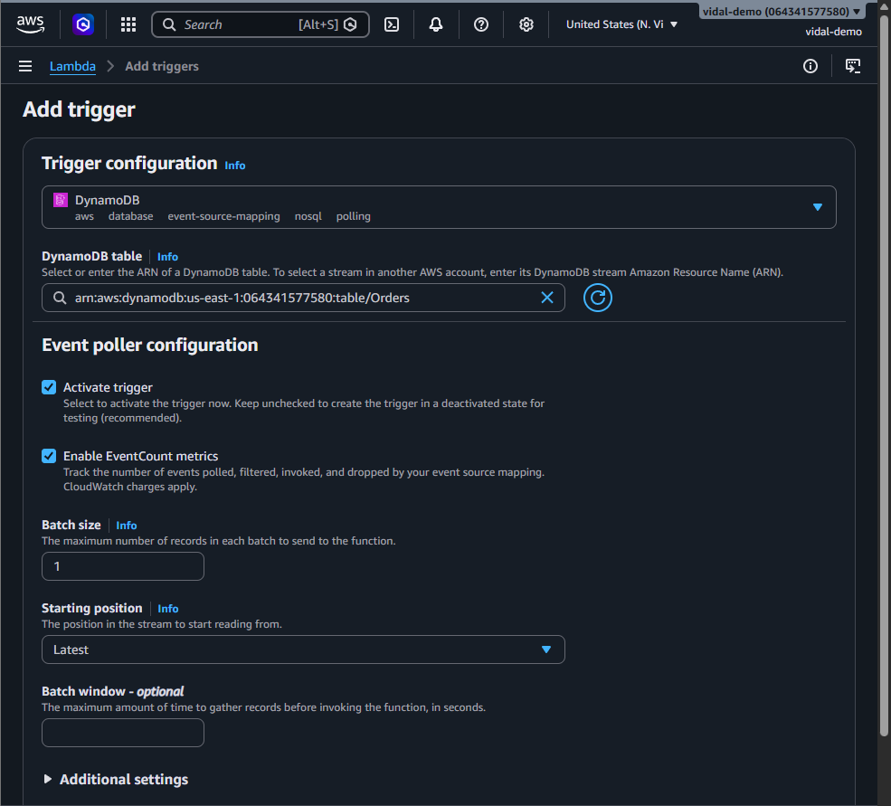

Using `LATEST` ensures that the Lambda processes new stream events generated after the trigger is created.

After adding the trigger, DynamoDB appeared as an event source for `ProcessOrderFunction`.

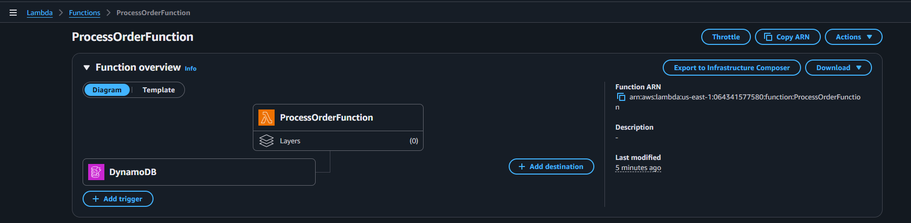

At this point, new order inserts can automatically invoke the processing Lambda.

---

## Step 7: Test and Validate Order Processing

The final step is to verify that newly submitted orders automatically move from:

```text
PENDING → PROCESSED
```

### Submit a New Test Order

From the frontend application, I submitted a new test order using:

- **Customer Name:** `Test User`
- **Product:** `Demo Product`
- **Amount:** `999`
- **Notes:** `Stream test`

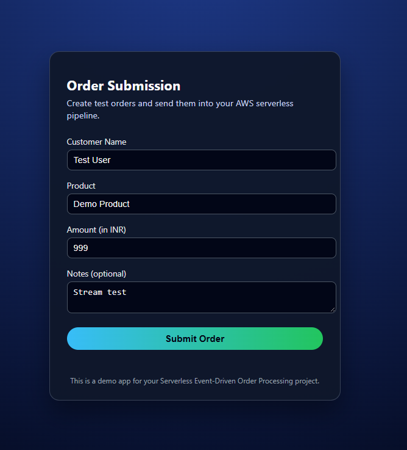

After clicking **Submit Order**, the application should return a successful response containing the new Order ID.

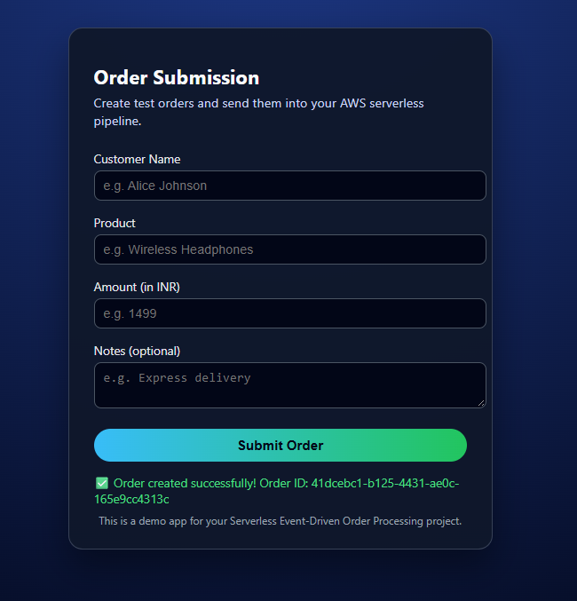

This confirms that the original `CreateOrderFunction` workflow is still working.

---

### Verify the Order in DynamoDB

Next, I opened:

```text
DynamoDB → Orders → Explore table items
```

and located the newly created order.

The order should now show:

```text
status = PROCESSED
```

and include a:

```text
processedAt
```

timestamp.

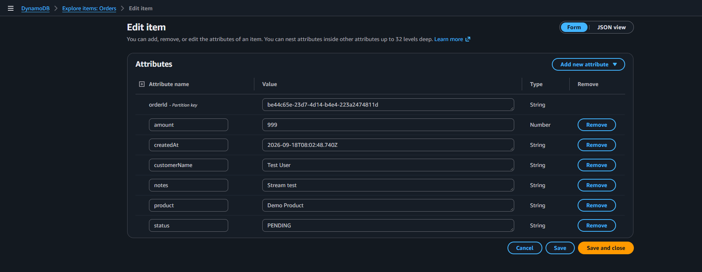

This confirms that DynamoDB Streams automatically triggered `ProcessOrderFunction` and updated the order without any manual processing.

---

### Check CloudWatch Logs

Finally, I opened:

```text
CloudWatch → Logs → Log groups
```

and selected:

```text
/aws/lambda/ProcessOrderFunction
```

Inside the latest log stream, I verified messages showing that the Lambda received and processed the DynamoDB Stream event.

Expected log entries include:

```text
Received DynamoDB Stream event
Processing new order
Order ... marked as PROCESSED
```

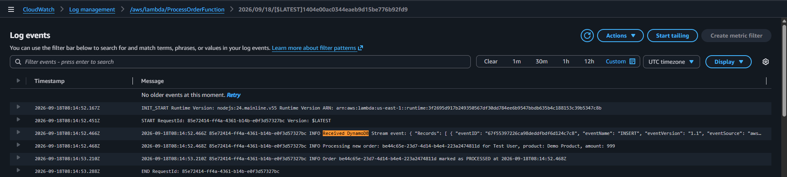

These logs confirm that:

- DynamoDB generated a stream record
- `ProcessOrderFunction` received the event
- The new order was processed
- The DynamoDB item was successfully updated

---

## Completion

The order processing workflow is now **event-driven**.

New orders can automatically move from:

```text
PENDING → PROCESSED
```

without requiring another request from the user.

The system now includes:

- DynamoDB Streams
- Automatic Lambda invocation
- Background order processing
- Order status updates
- Processing timestamps
- CloudWatch logging

The next stages of the project will introduce additional reliability features such as retries, dead-letter handling, and separate routing logic.

---

# 4.4 Add Reliability with SQS, Retries & DLQs

---

## Overview

The order processing system currently follows this workflow:

```text
Frontend → API Gateway → CreateOrderFunction → DynamoDB
DynamoDB Streams → ProcessOrderFunction → DynamoDB
```

The event-driven workflow is working, but it still needs better failure handling.

If order processing fails, the system currently has no dedicated mechanism for:

- Retrying temporary failures
- Handling traffic spikes
- Isolating messages that repeatedly fail
- Inspecting failed events later for troubleshooting

In this section, I will introduce **Amazon SQS** and a **Dead-Letter Queue (DLQ)** to make the order processing workflow more resilient.

The updated order lifecycle will be:

```text
PENDING → PROCESSING → COMPLETED / FAILED
```

The system will also introduce a worker Lambda that applies business rules and processes messages asynchronously.

---

## Step 1: Create the Dead-Letter Queue

I first created the Dead-Letter Queue because the main processing queue will reference it.

### Queue Configuration

- **Queue type:** Standard
- **Queue name:** `order-processing-dlq`


The DLQ will store messages that repeatedly fail processing so they can be inspected later.

---

## Step 2: Create the Main Order Processing Queue

Next, I created the main SQS queue that will hold orders waiting for background processing.

### Queue Configuration

- **Queue type:** Standard
- **Queue name:** `order-processing-queue`


### Dead-Letter Queue Configuration

I enabled the Dead-Letter Queue option and configured:

- **DLQ:** `order-processing-dlq`
- **Maximum receives:** `3`


This means that if a message fails processing three times, SQS will move it to the DLQ.

---

## Step 3: Update ProcessOrderFunction

Previously, `ProcessOrderFunction` immediately changed orders to `PROCESSED`.

The workflow will now be changed so that `ProcessOrderFunction`:

1. Changes the order status from `PENDING` to `PROCESSING`
2. Sends the order to Amazon SQS
3. Allows a separate worker Lambda to determine the final result

---

### Add the SQS Environment Variable

Inside `ProcessOrderFunction`, I added another environment variable.

```text
Key: ORDER_QUEUE_URL
Value: <order-processing-queue URL>
```

The existing table environment variable remains:

```text
ORDERS_TABLE_NAME = Orders
```


---

### Update ProcessOrderFunction Code

The function now updates the order to `PROCESSING` and publishes the order details to SQS.

```javascript
import { DynamoDBClient, UpdateItemCommand } from "@aws-sdk/client-dynamodb";
import { SQSClient, SendMessageCommand } from "@aws-sdk/client-sqs";

const ddbClient = new DynamoDBClient();
const sqsClient = new SQSClient();

export const handler = async (event) => {
  console.log(
    "Received DynamoDB Stream event:",
    JSON.stringify(event, null, 2)
  );

  const tableName = process.env.ORDERS_TABLE_NAME;
  const queueUrl = process.env.ORDER_QUEUE_URL;

  const records = event.Records || [];

  for (const record of records) {
    const eventName = record.eventName;

    if (eventName !== "INSERT") {
      console.log(`Skipping event ${eventName}`);
      continue;
    }

    const newImage = record.dynamodb?.NewImage;

    if (!newImage) {
      console.log("No NewImage found, skipping");
      continue;
    }

    const orderId = newImage.orderId.S;
    const customerName = newImage.customerName.S;
    const amount = Number(newImage.amount.N);
    const product = newImage.product.S;
    const notes = newImage.notes?.S || "";
    const createdAt = newImage.createdAt.S;

    console.log(
      `ProcessOrderFunction picked up order ${orderId} (${product}) amount: ${amount}`
    );

    const processingStartedAt = new Date().toISOString();

    const updateParams = new UpdateItemCommand({
      TableName: tableName,
      Key: {
        orderId: { S: orderId },
      },
      UpdateExpression:
        "SET #s = :status, processingStartedAt = :processingStartedAt",
      ExpressionAttributeNames: {
        "#s": "status",
      },
      ExpressionAttributeValues: {
        ":status": { S: "PROCESSING" },
        ":processingStartedAt": { S: processingStartedAt },
      },
    });

    try {
      await ddbClient.send(updateParams);

      console.log(
        `Order ${orderId} marked as PROCESSING at ${processingStartedAt}`
      );
    } catch (error) {
      console.error(
        `Failed to update order ${orderId} to PROCESSING:`,
        error
      );
    }

    const sqsPayload = {
      orderId,
      customerName,
      amount,
      product,
      notes,
      createdAt,
      processingStartedAt,
    };

    const sendCommand = new SendMessageCommand({
      QueueUrl: queueUrl,
      MessageBody: JSON.stringify(sqsPayload),
    });

    try {
      await sqsClient.send(sendCommand);

      console.log(
        `Order ${orderId} sent to SQS queue for worker processing`
      );
    } catch (error) {
      console.error(
        `Failed to send order ${orderId} to SQS:`,
        error
      );
    }
  }

  return {
    statusCode: 200,
    body: JSON.stringify({
      message: "Stream processed and sent to SQS",
    }),
  };
};
```

After updating the code, I deployed the Lambda function.


New orders will now move from:

```text
PENDING → PROCESSING
```

before being sent to SQS.

---

## Step 4: Create the OrderWorkerFunction

Next, I created a dedicated worker Lambda that consumes messages from the SQS queue.

The worker is responsible for determining whether an order should:

- Complete successfully
- Fail because of a business rule
- Throw a technical error and retry

---

### Create the Lambda Function

### Configuration

- **Function name:** `OrderWorkerFunction`
- **Runtime:** `Node.js 24.x`
- **Execution role:** `OrderServiceLambdaRole`


---

### Add the Environment Variable

I added the DynamoDB table name to the worker Lambda.

```text
ORDERS_TABLE_NAME = Orders
```


---

### Add the SQS Trigger

I connected `order-processing-queue` to `OrderWorkerFunction`.

### Trigger Configuration

- **Trigger:** SQS
- **Queue:** `order-processing-queue`
- **Activate trigger:** Enabled
- **Batch size:** `5`


---

### Add OrderWorkerFunction Code

The worker processes three different outcomes:

- Normal orders → `COMPLETED`
- Orders over the business limit → `FAILED`
- Messages containing `FAIL` → technical error and retry

```javascript
import { DynamoDBClient, UpdateItemCommand } from "@aws-sdk/client-dynamodb";

const ddbClient = new DynamoDBClient();
const tableName = process.env.ORDERS_TABLE_NAME;

export const handler = async (event) => {
  console.log("Received SQS event:", JSON.stringify(event, null, 2));

  for (const record of event.Records) {
    const body = record.body;
    let order;

    try {
      order = JSON.parse(body);
    } catch (error) {
      console.error("Failed to parse message body as JSON:", body);
      throw error;
    }

    const {
      orderId,
      customerName,
      amount,
      product,
      notes,
      processingStartedAt,
    } = order;

    console.log(
      `Worker processing order ${orderId} for ${customerName}, amount: ${amount}, product: ${product}`
    );

    if (
      typeof notes === "string" &&
      notes.toUpperCase().includes("FAIL")
    ) {
      console.error(
        `Simulated technical failure for order ${orderId} (notes contained 'FAIL')`
      );

      throw new Error(
        `Simulated worker failure for order ${orderId}`
      );
    }

    const now = new Date().toISOString();

    if (amount > 10000) {
      const failCommand = new UpdateItemCommand({
        TableName: tableName,
        Key: {
          orderId: { S: orderId },
        },
        UpdateExpression:
          "SET #s = :status, failureReason = :reason, failedAt = :failedAt",
        ExpressionAttributeNames: {
          "#s": "status",
        },
        ExpressionAttributeValues: {
          ":status": { S: "FAILED" },
          ":reason": { S: "AMOUNT_ABOVE_LIMIT" },
          ":failedAt": { S: now },
        },
      });

      try {
        await ddbClient.send(failCommand);

        console.log(
          `Order ${orderId} marked as FAILED (amount above limit)`
        );
      } catch (error) {
        console.error(
          `Failed to update order ${orderId} to FAILED:`,
          error
        );
      }

      continue;
    }

    const completeCommand = new UpdateItemCommand({
      TableName: tableName,
      Key: {
        orderId: { S: orderId },
      },
      UpdateExpression:
        "SET #s = :status, completedAt = :completedAt",
      ExpressionAttributeNames: {
        "#s": "status",
      },
      ExpressionAttributeValues: {
        ":status": { S: "COMPLETED" },
        ":completedAt": { S: now },
      },
    });

    try {
      await ddbClient.send(completeCommand);

      console.log(
        `Order ${orderId} marked as COMPLETED by worker`
      );
    } catch (error) {
      console.error(
        `Failed to update order ${orderId} to COMPLETED:`,
        error
      );

      throw error;
    }
  }

  return {};
};
```

After adding the code, I deployed `OrderWorkerFunction`.

---

## Order Processing Rules

The worker now supports three processing paths.

### Successful Order

A normal order will be updated to:

```text
status = COMPLETED
completedAt = <timestamp>
```

### Business Failure

If:

```text
amount > 10000
```

the order will be updated to:

```text
status = FAILED
failureReason = AMOUNT_ABOVE_LIMIT
failedAt = <timestamp>
```

This type of failure does not require a retry.

### Technical Failure

If the order notes contain:

```text
FAIL
```

the Lambda intentionally throws an error.

SQS will retry the message and eventually move it to the DLQ after the maximum receive count is reached.

---

## Step 5: Test the Normal Order Path

I first tested the successful order workflow.

### Test Order

- **Customer Name:** `Normal User`
- **Product:** `Demo Product`
- **Amount:** `1200`
- **Notes:** `Normal order`


After submitting the order, the expected lifecycle is:

```text
PENDING → PROCESSING → COMPLETED
```

In DynamoDB, the final order should show:

```text
status = COMPLETED
completedAt = <timestamp>
```


---

### Verify ProcessOrderFunction Logs

CloudWatch should show messages confirming that the order was:

```text
marked as PROCESSING
sent to SQS
```


---

### Verify OrderWorkerFunction Logs

The worker logs should show:

```text
Worker processing order
Order ... marked as COMPLETED
```


---

### Verify the SQS Queues

After successful processing, there should be no remaining messages in the main processing queue.


The Dead-Letter Queue should also remain empty.


---

## Step 6: Test the Business Failure Path

Next, I tested a valid order that violates the business rule.

### Test Order

- **Customer Name:** `High Value User`
- **Product:** `Demo Product`
- **Amount:** `20000`
- **Notes:** `High value order`


The expected lifecycle is:

```text
PENDING → PROCESSING → FAILED
```

DynamoDB should show:

```text
status = FAILED
failureReason = AMOUNT_ABOVE_LIMIT
failedAt = <timestamp>
```


Because this is a business-rule rejection rather than a technical failure, the worker does not throw an exception.

The SQS message is considered successfully processed and should not enter the DLQ.


---

## Step 7: Test the Technical Failure and DLQ Path

Finally, I tested the retry and Dead-Letter Queue behavior.

### Test Order

- **Customer Name:** `Failing User`
- **Product:** `Demo Product`
- **Amount:** `1500`
- **Notes:** `Please FAIL this order`


Because the notes contain `FAIL`, `OrderWorkerFunction` intentionally throws an error.

The order will move from:

```text
PENDING → PROCESSING
```

and may remain in `PROCESSING` because the worker never reaches the normal completion or business-failure update.


---

### Retry Behavior

The processing flow is:

```text
order-processing-queue
        ↓
OrderWorkerFunction
        ↓
Technical error
        ↓
SQS retry
        ↓
SQS retry
        ↓
SQS retry
        ↓
order-processing-dlq
```

CloudWatch Logs should show repeated worker failures for the same order.


---

### Verify the Dead-Letter Queue

After the message exceeds the configured maximum receive count, it should be moved to:

```text
order-processing-dlq
```

I opened:

```text
SQS → order-processing-dlq → Send and receive messages
```

and polled the queue.


The message body contains the original order payload, which can be inspected for troubleshooting.


---

## Completion

The order processing system now includes a more reliable asynchronous workflow.

The order lifecycle supports:

```text
PENDING → PROCESSING → COMPLETED / FAILED
```

The architecture now includes:

- Amazon SQS for asynchronous order processing
- Automatic retry handling
- A dedicated `OrderWorkerFunction`
- Business-rule validation
- Technical failure simulation
- Dead-Letter Queue handling
- CloudWatch logging
- Failed-message inspection

The updated event-driven workflow is:

```text
DynamoDB Streams
       ↓
ProcessOrderFunction
       ↓
Amazon SQS
       ↓
OrderWorkerFunction
       ↓
DynamoDB
```

Business failures are recorded directly in DynamoDB, while technical failures are automatically retried and eventually isolated in the DLQ.

The next stage will introduce **EventBridge Pipes** for routing specific orders into dedicated processing workflows.

---
